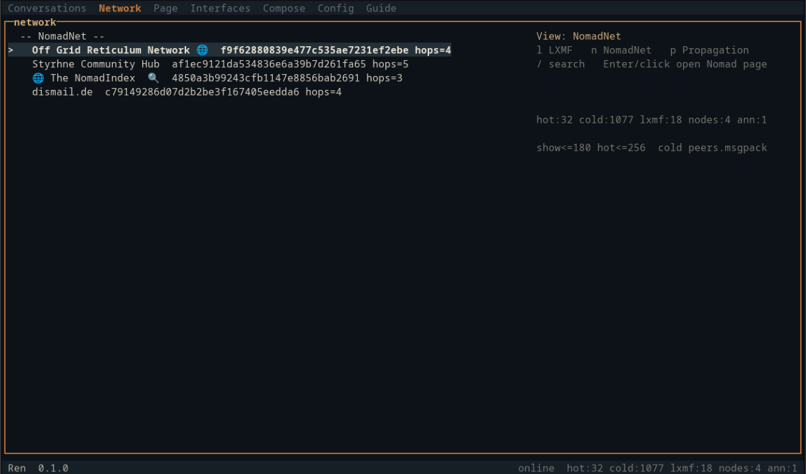

# Ren TUI

This project is an early prototype. Behavior may be wrong, incomplete, or unsafe.
Do not rely on it for sensitive messaging. Use at your own risk.

Ren TUI is a terminal LXMF client for [Reticulum](https://reticulum.network/) built with Odin on librns (Reticulum-Go). It aims for NomadNet-like messaging/browsing without urwid or ncurses.



rngit: `git clone rns://06a54b505bb67b25ef3f8097e8001edc/public/ren-tui`

Reticulum-Go: dev branch

## Design

Custom TUI, not a curses wrapper. Raw terminal I/O, cell buffer, and a small widget set.

Tabs:

| Tab | Role |
|-----|------|
| Conversations | Message threads (persisted under `~/.config/ren-tui/conversations/`) |
| Network | Peers grouped LXMF / NomadNet / Propagation (announce stream) |
| Page | Full-screen NomadNet micron viewer |
| Interfaces | Sorted interface cards with status |
| Compose | Send to an LXMF address |
| Config | Name, announce, color mode, theme, restart, addresses |
| Guide | Short in-app notes |

Config is plaintext at `~/.config/ren-tui/config` (NomadNet-style INI). Conversations are stored as msgpack per peer (atomic write), similar in spirit to NomadNet's on-disk approach.

### TUI renderer

Immediate-mode drawing into a retained cell buffer, then a dirty-cell present when possible.

```
each tick:
  resize buffer if needed
  if dirty:
    clear cells
    draw(app) -> widgets write into Buffer
    term_present -> ANSI for changed cells (full frame on first or resize)
  poll input (short timeout)
  session_poll -> advance page/send jobs and drain typed events
```

| Piece | Role |
|-------|------|
| `ren/ui/loop.odin` | Frame loop owns theme and caps, clear -> draw -> present -> poll |
| `ren/ui/buffer.odin` | Flat `[]Cell` (rune + RGB + style) |
| `ren/ui/widgets.odin` | Stateless list / input / box / tabs painters |
| `ren/ui/term.odin` | Raw mode, alt screen, dirty-cell SGR present via `Term.prev` |
| `ren/app/` | Tab layouts, theme apply, micron paint into Buffer |

There is no widget tree and no retained scene graph. App state lives in `App`, the screen is rebuilt from that state when dirty. Theme and terminal caps hang on `ui.Loop` (activated for draw/present). Standalone tests can use a fallback when no loop is active.

### Packages and boundaries

| Package | Role |
|---------|------|
| `ren/app` | Shell: tabs, input, draw, theme apply, micron paint |
| `ren/ui` | Terminal I/O, buffer, widgets, loop context |
| `ren/net` | librns session, typed events, page job, async send job |
| `ren/store` | Config INI, peers, conversations (no UI types) |
| `ren/micron` | Parse/resolve micron to RGB IR (no Buffer dependency) |
| `ren/lxmf` | Msgpack, LXMF pack/sign, identity, hex helpers |

`store` and `micron` do not import `ren:ui`. Theme overrides are store strings applied through `app.config_apply_theme`. Micron pages are painted by `app.paint_doc`.

### Session events and async send

Network work advances on the UI poll tick. Page fetch was already a non-blocking job. Direct LXMF send uses the same pattern (`session_send_begin` / `Send_Job`) so compose does not block the frame loop waiting on a link.

`net.Session` keeps a small typed event ring (`Message_Received`, `Send_Ok`, `Send_Failed`, `Page_Ok`, …). The UI drains events instead of comparing status strings for control flow. `session.status` remains a short human line for the status bar.

Send is rejected with `page busy` while a page job holds the link path (no dual-link send yet). Opportunistic and propagation *send* are still not implemented.

### LXMF and msgpack

Ren does **not** use a third-party msgpack library or Python LXMF bindings at runtime. Wire codec and conversation storage are a small custom stack under `ren/lxmf/`:

| File | Role |
|------|------|
| `msgpack.odin` | Encoder/decoder subset (nil/bool/int/uint/float/bin/str/array/map) |
| `message.odin` | LXMF pack/unpack, Ed25519 sign/verify |
| `identity.odin` | 64-byte identity material, hashes, sign |
| `hex.odin` | Shared hex32 decode for addresses and micron links |
| `stamp.odin` | Workfactor / ticket stamps |
| `announce.odin` | Announce app-data parse |
| `router.odin` | Compose + inbound stamp checks |
| `constants.odin` | Field ids, renderer ids, aspect names |

**Why custom msgpack:** LXMF payloads and on-disk conversations share one codec, size/depth limits are explicit (`MSGPACK_MAX_DEPTH`, `MSGPACK_MAX_ITEMS`, `MSGPACK_MAX_BYTES`), and there is no C/Go msgpack dependency beside librns for the network stack.

**Packed LXMF message (direct):**

```
[ destination_hash 16 ]
[ source_hash      16 ]   # lxmf.delivery hash of sender, not raw identity hash
[ signature        64 ]   # Ed25519 over dest|source|payload_core|message_id
[ msgpack payload       ]
```

**Msgpack payload** is an array:

```
[ timestamp f64,
  title     bin,
  content   bin,
  fields    map[int -> value],
  stamp     bin? ]          # optional 5th element
```

`message_id` is SHA-256 of `dest|source|payload_without_stamp`, truncated/full per LXMF rules in code. Signing covers that id as well. Field maps are encoded with **sorted keys** so pack/unpack/verify hashes stay stable.

**Opportunistic path:** peers may strip the leading destination hash on the wire. Receive path prepends the local delivery hash before `message_unpack(..., .Opportunistic)`.

**Conversations on disk:** per-peer msgpack under `~/.config/ren-tui/conversations/<peerhex>/messages.msgpack` (atomic `.tmp` + rename), using the same writer/reader.

Schema version `CONVERSATIONS_SCHEMA_VERSION` (currently 1) is the first array element on write. Readers still accept the older 4-element layout without a version field.

Supported msgpack subset for wire and storage: nil, bool, int, uint, float, bin, str, array, map, with explicit depth and size caps in `ren/lxmf/msgpack.odin`.

Interop with Python RNS/LXMF is checked in `tests/interop/` (optional if those packages are installed). Covers opportunistic and direct packed shapes, stamp presence, and an announce app-data fixture. Skips cleanly if the Python mesh stack cannot start.

### Theme and colors

Presets under `[ui] theme = ...`:

- `field` (default)
- `slate`
- `amber`
- `mono`

Cycle Theme in the Config tab, or set it in the config file. Optional `[theme]` section overrides any slot with `#RRGGBB` hex (stored as `store.Theme_Overrides`, applied onto the active `ui.Loop`):

```
[ui]
color = auto
theme = field
mouse = yes

[theme]
accent = #c4783a
bg = #0c1218
fg = #d8d0c0
```

Slots: `bg`, `fg`, `muted`, `border`, `accent`, `accent_dim`, `highlight_bg`, `highlight_fg`, `warn`, `ok`, `error`, `title`, `status_bg`, `status_fg`, `input_bg`, `tab_active`, `tab_idle`.

`color` / `REN_UI` still selects terminal color capability (`auto` / `256` / `full` / `compat` / `dumb`). Theme picks the RGB palette painted into that capability.

## Binaries

Odin emits **one ELF executable per target** (`ren-tui`, `ren-listen`). That is a single file, but it is **not fully static**.

Runtime needs:

- vendored `librns.so` (copied to `bin/` on build, rpath points at `bin/`)
- system `libc` / `libm` (and usually `libresolv`)

`vendor/librns/` ships the shared library, C header, and Odin bindings. Refresh with Make:

```
make vendor-librns RNS_ROOT=/path/to/Reticulum-Go
```

(That target builds librns in the upstream tree, then copies artifacts here.)

## Current Supported Platforms

| OS | Arch | Libc / notes | Status |
|----|------|--------------|--------|
| Linux | x86_64 (amd64) | glibc | Supported (`make`, Docker, releases) |
| Linux | x86_64 (amd64) | musl | Compiles (`LIBC=musl`) Go cgo runtime blocked |
| Linux | aarch64 (arm64) | glibc | Release matrix (`ubuntu-24.04-arm`) |
| Linux | i386 | glibc | Release matrix (Zig cross) |
| Linux | armv7 | glibc hard-float | Release matrix (Zig cross) |
| Linux | armv6 | glibc | Experimental release matrix (Zig cross) |
| macOS | arm64 | system | Release matrix (`macos-15`) |
| macOS | amd64 | system | Release matrix (`macos-15-intel`) |
| Windows | amd64 | MinGW via Zig | Zig-cross from Linux + `windows-2025` smoke |

Config directory defaults:

- Unix / macOS: `~/.config/ren-tui`
- Windows: `%APPDATA%\ren-tui`

Cross-compile (needs Odin, Zig, and `RNS_ROOT` for librns):

```
make cross TARGET=windows-amd64 RNS_ROOT=/path/to/Reticulum-Go
make cross TARGET=linux-i386 RNS_ROOT=/path/to/Reticulum-Go
make cross TARGET=linux-armv7 RNS_ROOT=/path/to/Reticulum-Go
```

Set `LIBC=glibc` or `LIBC=musl` to force a library set on host Linux. Default is auto-detect.
CI covers Ubuntu 22.04/24.04 (glibc) plus an Alpine musl compile check. Multi-OS release archives are produced on tag pushes.

## Supported Terminals

Ren targets modern terminals with UTF-8 and at least 16 colors. Truecolor and mouse work when the terminal advertises them (`COLORTERM=truecolor` / `24bit`, or a known `TERM`).

| Terminal | Notes |
|----------|--------|
| Alacritty | Truecolor (auto) |
| Kitty | Truecolor (auto) |
| foot | Truecolor (auto) |
| WezTerm | Truecolor (auto) |
| Ghostty | Usually truecolor via `COLORTERM` / `xterm-256color` |
| Contour | Usually truecolor via `COLORTERM` |
| xterm / xterm-256color | 256 color (truecolor if `COLORTERM` set) |
| tmux / screen | 256 color when outer TERM allows it (set `COLORTERM` / `tmux-256color` as needed) |
| rxvt-unicode | 256 color |
| GNOME Terminal / VTE | 256 or truecolor via `COLORTERM` |
| Konsole | 256 or truecolor via `COLORTERM` |
| Linux virtual console | Compat / ASCII borders (limited) |
| vt100 / vt102 | Compat mode, no mouse |

Force a mode with `REN_UI=full|256|compat|dumb` or `color = ...` in config. `NO_COLOR` disables color.

## Requirements

- Odin compiler
- Vendored librns (already in-tree under `vendor/librns`)
- A Reticulum config (defaults prefer `~/.reticulum-go/config`)
- A supported terminal with UTF-8 (see above)

## Build

```
make
make help
make test
make run
make install PREFIX=/usr/local
```

Optional:

```
make listen LIVE_SECS=30
man man/ren-tui.1
make package
make package-deb
make package-rpm
make package-arch
make package-nix
```

Packages write to dist/pkg. Deb needs dpkg-deb, rpm needs rpmbuild, Arch zst needs tar and zstd. Nix uses the flake (nix build). AUR-style builds can use packaging/PKGBUILD.

### CLI

```
ren-tui -h | --help
ren-tui -v | -V | --version
ren-tui -d | --daemon
ren-tui --paths
ren-tui --config PATH --data-dir PATH -c/--rns-config PATH
ren-tui --reset | --reset-config | --reset-conversations | --reset-identity

ren-listen -h --help -v --version --paths -t SECONDS -c PATH
```

`-d` / `--daemon` detaches on POSIX, keeps the LXMF/NomadNet session alive without a TUI, writes `data_dir/ren-tui.pid`, and logs to `data_dir/daemon.log`. Stop with `kill $(cat ~/.config/ren-tui/ren-tui.pid)`.

Environment:

- `REN_RNS_CONFIG` override Reticulum config path
- `REN_UI` force `full` / `256` / `compat` / `dumb`
- `NO_COLOR` disable color

## Tests

```
make test                 # all suites below
make test-smoke           # fast gate
make test-unit
make test-property
make test-fuzz
make test-acceptance
make test-e2e
make test-cross-terminal  # caps modes / glyphs / sanitize
make test-mutation        # bit-flips and bad inputs
make test-race            # threaded pack/unpack and theme reads
make test-chaos           # random op storm + depth limits
make test-interop         # Python LXMF (skips if missing)
```

Test Layout:

```
tests/smoke/            quick API/link gate
tests/unit/             focused package checks
tests/property/         encode/decode invariants
tests/fuzz/             seeded random bytes
tests/acceptance/       persistence and wire behaviors
tests/e2e/              multi-step flows without live mesh
tests/cross_terminal/   full/256/compat/dumb capability matrix
tests/mutation/         corrupted messages and codec edges
tests/race/             concurrent pack/unpack
tests/chaos/            randomized op sequences
tests/bench/            timed micron/conversations/UI benches (`make bench`)
tests/interop/          Python LXMF shapes (skips if stack missing)
```

Some UI suites still pin `ODIN_TEST_THREADS=1` for terminal/caps isolation. Theme state is Loop-scoped, so race theme tests can run parallel.

## Keys

- `1`-`7` or Tab: sections (Page is its own screen)
- Network `l` / `n` / `p`: LXMF / NomadNet / Propagation views
- Network or Conversations `/`: search
- Ctrl+R: announce now
- Ctrl+Q: quit
- Enter: send / open NomadNet node on Page / toggle config
- Network `Enter`: fetch node page onto Page screen
- Page `g`: page URL (`hash:/path` or `/path`)
- Page `s`: toggle rendered vs raw micron source
- Page `d`: download current page as `*.mu` into `download_dir`
- Page `[` `]` or PgUp/PgDn: scroll page
- Page Esc: back to Network (or cancel in-progress fetch)
- Esc: cancel in-progress page fetch
- Click Your LXMF Address in Config to copy (OSC 52)

Config `[client] download_dir` sets where Page `d` writes files. Empty means `~/.config/ren-tui/pages` (or `%APPDATA%\ren-tui\pages` on Windows). Relative paths are under the data dir.

Announce peers are hot-capped (256 in RAM). Overflow goes to `~/.config/ren-tui/peers.msgpack`. Network list rebuilds only on identity/name changes (not hops). TUI redraws only when dirty. Page stays isolated from the announce stream.

On panic or a fatal signal, ren-tui prints a short crash banner (version, `TERM` / `COLORTERM`, hints).

## Docker

Debian slim (glibc) images. See [docker/README.md](docker/README.md).

```
docker build -f docker/Dockerfile -t ren-tui .
docker run --rm -it ren-tui --version
```

Alpine musl builds exist as `docker/Dockerfile.alpine` but are not the default runtime yet (Go cgo librns crashes on musl).

## CI

Workflows under `.github/workflows/`. POSIX helpers live in `ci/scripts/` (curl + sha256 for Odin).

| Workflow | Role |
|----------|------|
| `ci.yml` | Matrix tests and glibc builds on Ubuntu 22.04 / 24.04, plus Alpine musl compile check |
| `release.yml` | Tag or manual draft-then-publish (immutable releases) |
| `docker.yml` | Build and push the Debian slim runtime image to GHCR |

Forks change pins in `.github/ci.env`. Actions are pinned to full commit SHAs.

## License

0BSD [LICENSE](LICENSE).
